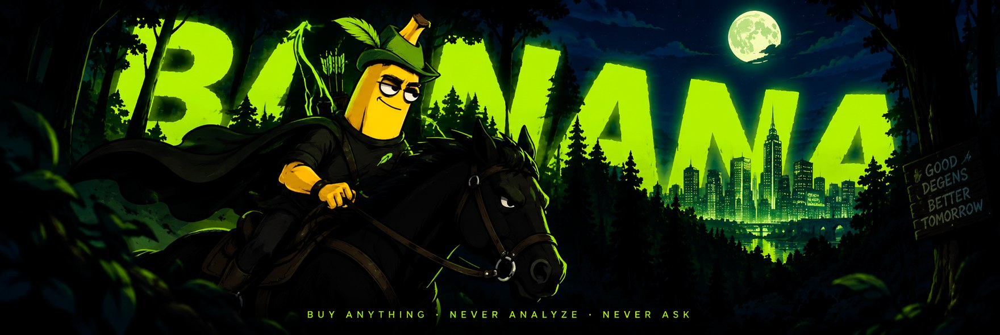

<p align="center">
  
</p>

<h1 align="center">banana</h1>

<p align="center">
  A local desktop sniper terminal and strategy backtester for
  <a href="https://pons.fun">pons</a> v2 on Robinhood Chain (chain id 4663).
</p>

<p align="center">
  <a href="../../releases"></a>
  <a href="../../actions/workflows/ci.yml"></a>
  <a href="LICENSE"></a>
  
</p>

---

Two halves sharing one rule engine:

- **Sniper** watches every pons v2 launch as it happens, evaluates it against a transparent
  boolean filter, waits until the opening tax decays under a ceiling you set, and buys.
- **Strategy Lab** indexes launch history locally, runs the same filter against it offline, and
  shows what actually happened to the tokens that passed.

The link between them is the point: the *same* `strategy.json` you tune in the Lab is what the
sniper trades from. One file, two consumers, no translation step.

Everything is local. Nothing leaves your machine except JSON-RPC to the endpoint you configure —
no telemetry, no vendor server, no third-party price API, no account, no wallet connection. The
webview's Content-Security-Policy makes outbound requests impossible rather than merely absent.

---

## Read this before you run it


**This software can lose all of the money you give it.** It is a trading tool for one of the most
adversarial markets there is. There is no warranty of any kind (see [LICENSE](LICENSE)).

Specifically, and in plain terms:

- **It does not detect rugs, honeypots or scams.** It reads what a launch declared about itself
  and what its deployer did before. That is all.
- **Roughly 1 launch in 78 graduates.** Measured on a 24-hour window of real chain history. The
  Lab is built to show you that denominator rather than bury it, including the tokens that passed
  your filter and went to zero.
- **A backtest is evidence about one window, not about a strategy.** If the whole chain was rising
  across the window you indexed, every strategy looks good. The Lab says so on the screen, every
  time, in the primary reading path.
- **The headline number is never a peak.** `max_multiple` is labelled "max achievable / peak" and
  never "profit", because nobody sells at the all-time high — it lasts seconds and is
  unidentifiable in the moment. The headline is always the fixed-hold multiple, which is what a
  rule you could actually have executed would have produced.
- **Your private key is stored in plaintext.** See [SECURITY.md](SECURITY.md). Use a wallet that
  holds only what you are prepared to lose.

### Two things LIVE mode will not do

LIVE has been exercised on mainnet by a small number of testers, on their own machines and their
own wallets. That is not the same as being proven: it is a young program trading a fast market,
and the sensible way to start is with an amount whose total loss would not change your week.

TEST mode is a real rehearsal rather than a mock. It detects launches, enriches them, evaluates
them, waits out the tax decay, prices the order and simulates it against the live curve with
`eth_call` and `eth_estimateGas` — every step, against the real chain. It stops at the signature,
because a TEST session holds no key and has nothing to sign with. Run it first.

Two gaps are not about testing but about code that is not written yet, and you will meet them:

| gap | what happens |
|---|---|
| A position that graduates to a Uniswap v4 pool while you hold it | The program refuses to sell it and tells you to sell by hand. The v4 router path is not implemented. |
| Launches paired against anything other than ETH (~60% of them) | Refused by name. A non-ETH quote needs allowance handling the program does not do. |

---

## Install

### Download a build

Grab the latest from [Releases](../../releases). Builds are produced by GitHub Actions from a
tagged commit — the workflow is in [`.github/workflows/release.yml`](.github/workflows/release.yml)
and you can read exactly what produced the binary you are downloading.

| platform | file |
|---|---|
| Windows 10/11 | `banana_<version>_x64_en-US.msi` or `banana_<version>_x64-setup.exe` |
| macOS (Apple Silicon) | `banana_<version>_aarch64.dmg` |
| macOS (Intel) | `banana_<version>_x64.dmg` |
| Linux (Debian/Ubuntu) | `banana_<version>_amd64.deb` |
| Linux (anything) | `banana_<version>_amd64.AppImage` |

**The builds are not code-signed.** That is a cost decision, not an oversight, and it means your
operating system will warn you:

- **Windows** shows "Windows protected your PC". Click *More info* → *Run anyway*.
- **macOS** refuses to open it: "banana is damaged" or "cannot be opened because the developer
  cannot be verified". Right-click the app → *Open* → *Open*, or run
  `xattr -dr com.apple.quarantine /Applications/banana.app`.
- **Linux** needs the AppImage marked executable: `chmod +x banana_*.AppImage`.

Every release publishes `SHA256SUMS.txt`. Verify before you run something that will hold a private
key:

```sh
sha256sum -c SHA256SUMS.txt --ignore-missing     # Linux / macOS
```
```powershell
Get-FileHash .\banana_0.1.0_x64_en-US.msi -Algorithm SHA256   # Windows
```

### Or build it yourself

You need [Rust](https://rustup.rs) 1.90+, [Node](https://nodejs.org) 20+, and your platform's
webview toolchain.

<details>
<summary><b>Windows</b></summary>

Install the [Visual Studio C++ Build Tools](https://visualstudio.microsoft.com/visual-cpp-build-tools/)
and [WebView2](https://developer.microsoft.com/microsoft-edge/webview2/) (already present on
Windows 11 and up-to-date Windows 10).
</details>

<details>
<summary><b>macOS</b></summary>

```sh
xcode-select --install
```
</details>

<details>
<summary><b>Linux (Debian/Ubuntu)</b></summary>

```sh
sudo apt update
sudo apt install libwebkit2gtk-4.1-dev build-essential curl wget file \
  libxdo-dev libssl-dev libayatana-appindicator3-dev librsvg2-dev
```
</details>

Then:

```sh
git clone https://github.com/plutos-eth/banana.git
cd banana

npm --prefix ui ci
npm --prefix ui run build          # the frontend is compiled into the binary
cargo build --release -p banana-app
```

The executable lands in `target/release/`. Run it with no arguments — it does not need any.

To produce installers (`.msi`, `.dmg`, `.deb`, `.AppImage`) instead of a bare binary:

```sh
cargo install tauri-cli --version "^2"
npm --prefix ui run build          # required first: see below
cargo tauri build --config crates/app/tauri.conf.json
```

The frontend build is a separate step on purpose. Tauri can run it for you through
`beforeBuildCommand`, but that command's working directory differs between a local run and
a CI runner, which produced a build that worked on one machine and could not find
`package.json` on the other. An explicit step is one line longer and always means the same
thing.

---

## Using it

1. **Choose a mode on startup.** TEST or LIVE, once per run. It cannot be changed while the
   process is running; changing your mind means restarting, which costs seconds and removes a
   whole class of accident.
2. **Index a window** (Index view). The last 24 hours is ~856,500 blocks and takes a while on the
   public endpoints. This is what the Lab reads.
3. **Tune rules and read the funnel** (Strategy Lab). The rule editor is the second half of that
   screen, and the count beside it comes from the same backtest as the funnel above it.
4. **Press `p`** to start the engine. In TEST it runs the entire pipeline and stops at the
   signature.

Keyboard: `1`–`5` switch views, `p` starts/stops the engine, `f` filters to passing launches, `/`
searches, `esc` closes a drawer.

### Where your data lives

| platform | path |
|---|---|
| Windows | `%APPDATA%\banana` |
| macOS | `~/Library/Application Support/banana` |
| Linux | `$XDG_DATA_HOME/banana`, or `~/.local/share/banana` |

Override with `--data-dir <path>`. A `data/` directory in the working directory wins over both,
which is what makes a development checkout use its own store.

It holds `history.db` (indexed chain facts, append-only), `live.db` (your positions, fills and
every refusal), `strategy.json`, and — only if you set one — `wallet.key`.

### Configuration

Everything except live trading works with no configuration at all. A `.env` beside the executable
can set `RPC_URL` (comma-separated, preferred first, `#nologs` to mark an endpoint that refuses
`eth_getLogs`). See [`.env.example`](.env.example). One private RPC endpoint will outperform the
public pair considerably — the request gate raises its own concurrency to whatever an endpoint
actually tolerates.

---

## How it is built

```
crates/core       the rule engine and curve maths. No I/O, no network, no database.
crates/chain      JSON-RPC, contract bindings, the priority gate every request passes through.
crates/store      SQLite. history.db (indexed facts) and live.db (what the sniper did).
crates/indexer    the four-phase indexer that fills history.db.
crates/backtest   the Lab: funnel, outcomes, honesty guards.
crates/live       detection, enrichment, execution. The only crate that may hold a key.
crates/app        the Tauri desktop shell.
crates/cli        headless indexing, for cron.
ui/               React frontend, compiled into the binary.
```

Three invariants are enforced by CI rather than by review, and they are the ones worth knowing:

- **`banana-live` is the only crate that may read a private key or sign anything.** Nothing below
  it may depend on it. `scripts/check-trust-boundary.ps1` fails the build otherwise.
- **The webview cannot reach the network.** A launch's calldata contains an attacker-controlled
  logo URL; if the webview could fetch it, a deployer would learn the IP of every banana user
  watching their launch, in real time, before they buy. The CSP forbids it and
  `scripts/check-ui-invariants.ps1` compares every directive exactly.
- **No colour, size or font lives outside `ui/src/tokens.css`.** Same script.

Source comments cite `PLAN.md` and `docs/FINDINGS.md`. Those are the project's design log and
measurement notes; they are not published. Where a comment says a number was measured, it was —
against real chain data on 2026-09-07 — and the ones that matter to a user are on this page.

Run the checks the way CI does:

```sh
cargo fmt --all -- --check
cargo clippy --workspace --all-targets -- -D warnings
cargo test --workspace
pwsh ./scripts/check-trust-boundary.ps1
pwsh ./scripts/check-ui-invariants.ps1
```

---

## Independence

**banana is not affiliated with, endorsed by, or connected to pons, Uniswap, Robinhood, or
Robinhood Chain.** It is an independent client that reads public chain data and submits ordinary
transactions.

The name, the artwork and the Robin Hood theme are a joke about the chain this runs on. They are
not a claim of any relationship with anyone, and nothing here is licensed from or approved by the
projects named above.

The tagline on the banner is likewise a joke, and the opposite of what the program does: it
analyses every launch against rules you write, refuses most of them, and tells you which rule
refused each one. If you want software that buys anything without asking, this is the wrong
repository.

## Licence

MIT — see [LICENSE](LICENSE). No warranty, express or implied.
